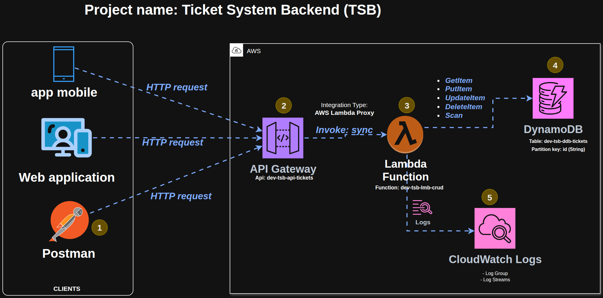

# AWS Serverless Ticket System Backend

Backend serverless para un sistema de tickets construido con AWS Lambda y DynamoDB.

## Descripción

Este proyecto implementa una API serverless que permite crear tickets mediante un endpoint REST. La aplicación utiliza AWS Lambda como función serverless y DynamoDB como base de datos NoSQL para almacenar los tickets.

## Arquitectura

El sistema está construido con una arquitectura serverless en AWS que incluye los siguientes componentes:



**Componentes principales:**

- **API Gateway** (`dev-tsb-api-tickets`): Punto de entrada para todas las peticiones HTTP desde clientes (aplicaciones móviles, web, Postman, etc.)
- **Lambda Function** (`dev-tsb-lmb-crud`): Función serverless que ejecuta la lógica de negocio y realiza operaciones CRUD
- **DynamoDB** (`dev-tsb-ddb-tickets`): Base de datos NoSQL para almacenar los tickets con `id` como partition key
- **CloudWatch Logs**: Servicio de monitoreo y logging para la función Lambda

**Flujo de datos:**
1. Los clientes envían peticiones HTTP al API Gateway
2. El API Gateway invoca sincrónicamente la función Lambda
3. La función Lambda realiza operaciones (GetItem, PutItem, UpdateItem, DeleteItem, Scan) en DynamoDB
4. Los logs de la función Lambda se envían automáticamente a CloudWatch Logs

## Estado Actual del Proyecto

Hasta el momento se ha implementado:

- ✅ **Función Lambda** configurada para manejar requests HTTP
- ✅ **Endpoint POST /v1/tickets** para crear nuevos tickets
- ✅ **Integración con DynamoDB** para almacenar los tickets en la tabla `dev-tsb-ddb-tickets`
- ✅ **Generación automática de IDs únicos** usando `crypto.randomUUID()`
- ✅ **Manejo básico de errores** con respuestas HTTP apropiadas
- ✅ **Script de despliegue** automatizado para actualizar la función Lambda

## Características

- Creación de tickets mediante API REST
- Almacenamiento en DynamoDB
- Implementación serverless con AWS Lambda
- Generación automática de IDs únicos para tickets

## Requisitos

- Node.js (versión 22 o superior)
- AWS CLI configurado con credenciales apropiadas
- Cuenta de AWS con permisos para:
  - Lambda
  - DynamoDB

## Instalación

1. Clona el repositorio:
```bash
git clone <repository-url>
cd aws-serverless-ticket-system-backend-tutorial
```

2. Instala las dependencias:
```bash
npm install
```

## Configuración

Asegúrate de tener configurado AWS CLI con tus credenciales:
```bash
aws configure
```

La función Lambda espera una tabla de DynamoDB llamada `dev-tsb-ddb-tickets`. Asegúrate de que esta tabla exista en tu cuenta de AWS.

## Infraestructura

Para esta primera parte del proyecto, toda la infraestructura ha sido creada **manualmente** a través de la consola de AWS, tal y como se explica en los videos de la serie. Esto incluye:

- ✅ **Función Lambda** (`dev-tsb-lmb-crud`): Creada y configurada manualmente
- ✅ **API Gateway** (`dev-tsb-api-tickets`): Configurado con integración Lambda Proxy
- ✅ **Tabla DynamoDB** (`dev-tsb-ddb-tickets`): Creada con `id` como partition key
- ✅ **Permisos IAM**: Políticas del rol de la función Lambda configuradas manualmente para permitir operaciones en DynamoDB y CloudWatch Logs

**Nota sobre Infrastructure as Code (IaC):**

Aunque actualmente la infraestructura se gestiona manualmente, existe el potencial de migrar a un enfoque de Infrastructure as Code (IaC) en el futuro utilizando herramientas como:
- AWS CloudFormation
- AWS CDK (Cloud Development Kit)
- Terraform
- Serverless Framework

Esto permitiría versionar la infraestructura, automatizar su creación y mantener consistencia entre entornos.

## Convención de Nombres de Recursos

**Importante:** Los nombres de recursos utilizados en este proyecto (como `dev-tsb-lmb-crud`, `dev-tsb-api-tickets`, `dev-tsb-ddb-tickets`) son **referenciales** y se utilizan como ejemplo en el tutorial. Puedes adaptarlos según tus necesidades o convenciones de nomenclatura.

### Formato de Nomenclatura

Los recursos siguen la siguiente convención de nombres:

```
<environment>-<project>-<resource-type>-<name>
```

### Ejemplos de Recursos

- `dev-tsb-api-tickets` - API Gateway para el sistema de tickets
- `dev-tsb-lmb-crud` - Función Lambda que maneja operaciones CRUD
- `dev-tsb-ddb-tickets` - Tabla DynamoDB para almacenar tickets

### Leyenda de Abreviaciones

- **`tsb`** = Ticket System Backend
- **`lmb`** = Lambda
- **`api`** = API Gateway
- **`ddb`** = DynamoDB

### Componentes del Nombre

1. **`dev`** - Entorno (development). Otros ejemplos: `staging`, `prod`, `test`
2. **`tsb`** - Identificador del proyecto (Ticket System Backend)
3. **`lmb`/`api`/`ddb`** - Tipo de recurso AWS
4. **`crud`/`tickets`** - Nombre descriptivo del recurso específico

Esta convención ayuda a:
- Identificar rápidamente el entorno y propósito de cada recurso
- Organizar recursos en la consola de AWS
- Facilitar la gestión y búsqueda de recursos
- Mantener consistencia en proyectos multi-entorno

## Uso

### Desarrollo Local

Para probar la función localmente, puedes usar herramientas como AWS SAM o el runtime de Node.js directamente.

### Despliegue

El despliegue actual es **básico** pero representa los primeros pasos hacia la automatización del proceso. Para desplegar la función a AWS Lambda, ejecuta el script de despliegue:

```bash
./deploy.sh
```

O manualmente:

```bash
npm run zip
aws lambda update-function-code \
  --function-name dev-tsb-lmb-crud \
  --zip-file fileb://deployment-package.zip \
  --region us-east-1
```

**Nota sobre el despliegue:**

El script `deploy.sh` actual:
- Empaqueta el código y las dependencias en un archivo ZIP
- Actualiza el código de la función Lambda existente

Este es un enfoque inicial y funcional que puede evolucionar hacia soluciones más robustas como:
- Integración con CI/CD (GitHub Actions, GitLab CI, Jenkins, etc.)
- Despliegues multi-entorno (dev, staging, production)
- Validaciones y tests automatizados antes del despliegue
- Rollback automático en caso de errores

## Contrato OpenAPI

Este proyecto sigue un enfoque **API First**, donde el contrato de la API está definido antes de la implementación. El contrato OpenAPI 3.0.4 se encuentra en:

📄 [`openapi/api.yaml`](openapi/api.yaml)

El contrato define:
- Todos los endpoints disponibles (POST, GET, PUT, PATCH, DELETE)
- Los esquemas de datos para requests y responses
- Los códigos de estado HTTP y mensajes de error
- Ejemplos de uso para cada endpoint
- Autenticación mediante Bearer Token (JWT)

Puedes visualizar y probar el contrato usando herramientas como:
- [Swagger Editor](https://editor.swagger.io/)
- Postman (importando el archivo YAML)

## API Endpoints

### POST /v1/tickets

Crea un nuevo ticket.

**Request Body:**
```json
{
  "title": "Ticket title",
  "description": "Ticket description",
  "priority": "high"
}
```

**Response:**
- **201 Created**: Ticket creado exitosamente
  ```json
  {
    "id": "uuid-generated",
    "title": "Ticket title",
    "description": "Ticket description",
    "priority": "high"
  }
  ```

- **500 Internal Server Error**: Error en el procesamiento

## Estructura del Proyecto

```
.
├── index.mjs                    # Función Lambda principal
├── package.json                 # Dependencias del proyecto
├── deploy.sh                    # Script de despliegue
├── openapi/
│   └── api.yaml                 # Contrato OpenAPI 3.0.4
├── docs/
│   └── architecture/
│       └── architecture.png     # Diagrama de arquitectura
└── README.md                    # Este archivo
```

## Dependencias

- `@aws-sdk/client-dynamodb`: Cliente de DynamoDB de AWS SDK v3
- `@aws-sdk/lib-dynamodb`: Utilidades para trabajar con DynamoDB

## Scripts Disponibles

- `npm run zip`: Crea el paquete de despliegue (deployment-package.zip)
- `npm test`: Ejecuta los tests (pendiente de implementar)

## Notas

- La función Lambda está configurada para la región `us-east-1`
- Los nombres de recursos (`dev-tsb-lmb-crud`, `dev-tsb-api-tickets`, `dev-tsb-ddb-tickets`) son referenciales y pueden adaptarse según tus necesidades
- Si cambias los nombres de los recursos, asegúrate de actualizar las referencias en el código y scripts de despliegue

## Licencia

ISC

